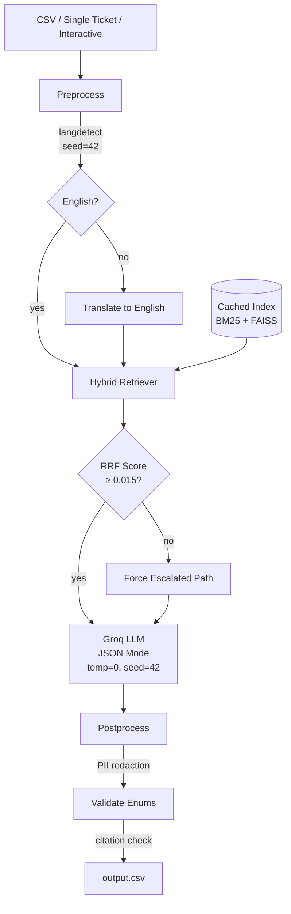
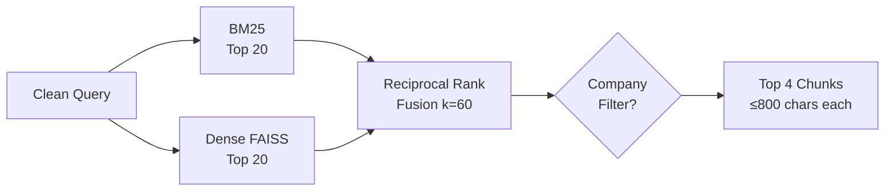
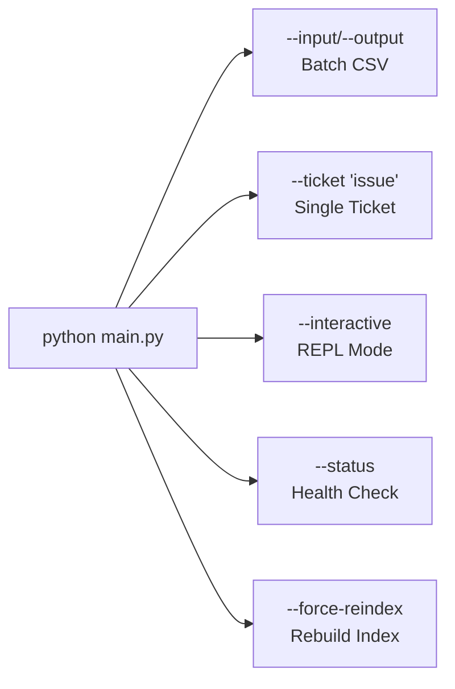

# TriageForge — Design Document

## Summary

Terminal-based support ticket triage agent. Classifies and responds to tickets across HackerRank, Claude, and Visa using hybrid RAG, grounded entirely in the provided corpus. One LLM call per ticket, with PII redaction and multilingual support.

## Architecture

## Retrieval Pipeline

## CLI Commands

## Design Decisions

### 1. Hybrid Retrieval (BM25 + Dense + RRF)

Combines sparse and dense retrieval with Reciprocal Rank Fusion.

- **BM25:** Catches exact tokens — phone numbers, "SCIM", "3-D Secure"
- **Dense (bge-small-en-v1.5):** Catches semantic similarity and paraphrase
- **RRF k=60:** Standard constant (Cormack et al. 2009). Lower k = more weight to top results.
- **Retrieval floor (0.015):** A doc must appear in at least one top-20 list. Below this → forced escalation.

### 2. One LLM Call Per Ticket

Classification and response generation are coupled. Splitting them adds latency without quality gain — the model needs retrieval context to decide whether to escalate.

### 3. Model Strategy

| Purpose | Model | Reason |
|---|---|---|
| Development/testing | `llama-3.1-8b-instant` | High rate limit, fast iteration |
| Final submission | `llama-3.3-70b-versatile` | Best quality for the one run that counts |

Both via Groq free tier. Switch by changing `LLM_MODEL` in `.env`.

### 4. Product Area Taxonomy

Closed set of canonical labels derived from corpus folder structure:

| Company | Areas |
|---|---|
| HackerRank | screen, community, interviews, settings, skillup, library, engage, integrations |
| Claude | conversation_management, privacy, billing, api, teams, claude_code, claude_desktop, safeguards, connectors |
| Visa | travel_support, general_support, fraud_protection, dispute_resolution |
| General | general |

**Dual-signal approach:**
1. LLM picks from the taxonomy (instructed to use chunk source paths as signal)
2. Postprocess validates: if all retrieved chunks unanimously point to one area and the LLM disagrees, chunk consensus wins

This prevents the "general" fallback problem — retrieval paths are a strong structural signal that doesn't depend on LLM interpretation.

### 5. Response Tone

Calibrated from expected outputs in `sample_support_tickets.csv`:
- Direct but warm: brief natural acknowledgment, then straight to the answer
- Numbered steps for multi-step procedures
- Include specific data (URLs, phone numbers, exact UI paths) from docs
- "Knowledgeable, friendly colleague" — not a robot, not a customer service script
- Clean endings without excessive pleasantries

### 6. Multilingual Support

Non-English tickets → translate query to English for retrieval → LLM responds in original language (instructed in system prompt rule 6). Justification is always written in English for evaluator readability.

### 7. Error Handling

- Startup validation: checks API key format, data directory, index status
- Per-ticket: caught exceptions → graceful escalation with error in justification
- Rate limits: exponential backoff (5 retries, 10s base delay)
- Health check command: `python main.py --status`

## Failure Modes

| Failure | Mitigation | Residual Risk |
|---|---|---|
| No relevant docs | RRF threshold → force escalate | Unnecessary escalation |
| Prompt injection | System prompt isolation | Novel attacks |
| Hallucination | Grounding rules + citations | Subtle paraphrase |
| Wrong product area | Closed taxonomy + chunk consensus | Category ambiguity |
| Non-English query | Query translation before retrieval | Translation quality |
| Rate limits | Backoff + model fallback | Extended outages |
| Missing API key | Startup validation with clear message | — |

## Performance

| Metric | Value |
|---|---|
| Latency/ticket | ~3-5s |
| Full run (29 tickets) | ~9 min |
| Cost | $0 (Groq free tier) |
| Index build | ~8 min (first run) |
| Index load | ~3s (cached) |
| Determinism | temperature=0, seed=42, DetectorFactory.seed=42 |
| Status accuracy | 100% (sample set) |
| Request type accuracy | 100% (sample set) |
